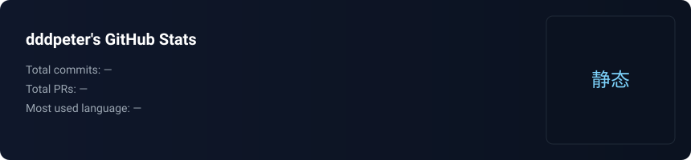

  # 🌟 我是 dddpeter（烈焰之雨）

  

  

    
    
    
    
  

<!-- 分隔 -->

## 关于我

我叫 dddpeter（烈焰之雨），来自北京。自 2012 年起在 GitHub 上探索与开发，热衷于把想法变成可交付的工程解决方案。

- 🔭 当前方向：DeVOps 自动化、macOS 效率工具与跨平台应用
- 🌱 正在学习：Rust / Flutter / WebAssembly
- 💬 擅长：系统设计、工程化、性能优化
- ⚡ 爱好：摄影、徒步与咖啡

---

## 技能与工具

  

- 语言：Java / Kotlin / Swift / TypeScript / JavaScript / Dart / Python
- 平台：Android / macOS / Flutter / Node.js
- DevOps：CI/CD、容器化（Docker）、K8s、自动化运维
- 工具：Git / Gradle / Fastlane / Vite / VSCode

---

## 精选项目

下面为你精选了 5 个代表性项目（点击标题查看仓库）：

- [SpeedScout](https://github.com/dddpeter/SpeedScout) — macOS 状态栏网速监控小工具（Swift）
- [rainweather-flutter](https://github.com/dddpeter/rainweather-flutter) — Flutter 跨平台天气应用（Dart）
- [BingPaper](https://github.com/dddpeter/BingPaper) — 使用必应每日壁纸作为 macOS 桌面背景的工具（Swift）
- [Alle](https://github.com/dddpeter/Alle) — AI 识别的邮件聚合客户端（示例/实验性项目）
- [email-mcp](https://github.com/dddpeter/email-mcp) — 基于 MCP 的邮件 AI 服务（支持 MCP-X, Claude 等客户端）

更多仓库：https://github.com/dddpeter?tab=repositories

---

## 📊 活跃数据（本地托管，避免第三方失效）

<!-- 三张卡片放在一行，宽度统一 -->

  
  
  

注：图片为仓库托管的 SVG，占位或自动更新（如果启用 workflow）。如需我把这些 SVG 做成漂亮的并排卡片或添加阴影/圆角效果，我可以进一步美化。

---

## 联系我

  
  
  

> 若需要上传微信二维码至仓库（例如 images/wechat.png），我可以帮你把 README 引用到该图片。

---

> 持续构建，持续学习。🚀

<footer align="center">
  
此 README 已按模板美化并保留本地统计卡片（images/ 下的 SVG）。如需我把统计改为自动更新（GitHub Action）或把精选项目替换为带预览的 pin 卡，请告诉我。

</footer>
