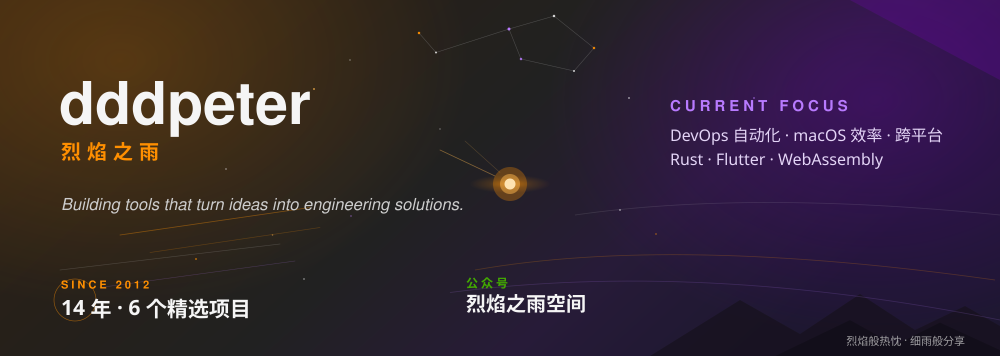

&nbsp;
&nbsp;
&nbsp;
&nbsp;

---

## 关于我

我叫 dddpeter（烈焰之雨），来自北京。自 2012 年起在 GitHub 上探索与开发，热衷于把想法变成可交付的工程解决方案。

🔭 **当前方向** —— DevOps 自动化 · macOS 效率工具 · 跨平台应用 
🌱 **正在学习** —— Rust · Flutter · WebAssembly 
💬 **擅长领域** —— 系统设计 · 工程化 · 性能优化 
⚡ **兴趣爱好** —— 摄影 · 徒步 · 咖啡

---

## 技能与工具

**语言** · Java / Kotlin / Swift / TypeScript / Dart / Python 
**平台** · Android / macOS / Flutter / Node.js 
**DevOps** · CI/CD · Docker · Kubernetes · 自动化运维 
**工具** · Git / Gradle / Fastlane / Vite / VSCode

---

## 精选项目

| 项目 | 简介 | 活跃度 |
|------|------|--------|
| [⚡ **picoclaw**](https://github.com/dddpeter/picoclaw) | 小而快、随处部署的自动化工具 |   |
| [🧹 **skill-audit**](https://github.com/dddpeter/skill-audit) | openclaw + hermes 的 Skill 审计与清理工具 |   |
| [📮 **email-mcp**](https://github.com/dddpeter/email-mcp) | 让 AI 轻松接管邮箱的 MCP 服务，支持 Claude 等客户端 |   |
| [🔐 **gitleaks-scanner**](https://github.com/dddpeter/gitleaks-scanner) | Rust 实现的 Git 敏感信息（密钥/凭证）扫描工具 |   |
| [💬 **hermes-lark-streaming**](https://github.com/dddpeter/hermes-lark-streaming) | Hermes Agent 的飞书 / Lark Channel 插件 |   |
| [🌦️ **rainweather-flutter**](https://github.com/dddpeter/rainweather-flutter) | Flutter 跨平台天气应用 |   |

📦 按<b>最近推送时间</b>排序 · <a href="https://github.com/dddpeter?tab=repositories&sort=pushed">查看全部仓库</a>

---

## GitHub 统计

<picture>
  <source media="(prefers-color-scheme: dark)" srcset="assets/stars-top10-dark.svg">
  
</picture>

<picture>
  <source media="(prefers-color-scheme: dark)" srcset="assets/commits-top10-dark.svg">
  
</picture>

📈 图表由 GitHub Actions 每日自动更新 · 数据来自 GitHub API（仅公开仓库）

---

## 微信公众号

<table>
  <tr>
    <td width="140"></td>
    <td valign="top">
      <b>🔥 烈焰之雨空间</b> —— 专注技术干货与实战教程的公众号 
      <i>烈焰般的热忱钻研技术，细雨般的分享陪伴成长。</i> 
      📚 <b>实战教程</b> —— 从 0 到 1，代码可跑、拿来即用 
      💡 <b>技术干货</b> —— DevOps / 后端 / 移动端 / AI 工程化 
      🔧 <b>踩坑实录</b> —— 踩过的坑、填过的雷，帮你少走弯路 
      🚀 <b>效率神器</b> —— 开发工具、开源项目与工作流 
      &nbsp;&nbsp; 
      👉 微信搜索「<b>烈焰之雨空间</b>」关注，干货不错过！
    </td>
  </tr>
</table>

---

## 联系我

&nbsp;
&nbsp;
&nbsp;

---

⭐ 喜欢我的项目？欢迎 Star & Follow · 持续构建，持续学习 🚀
